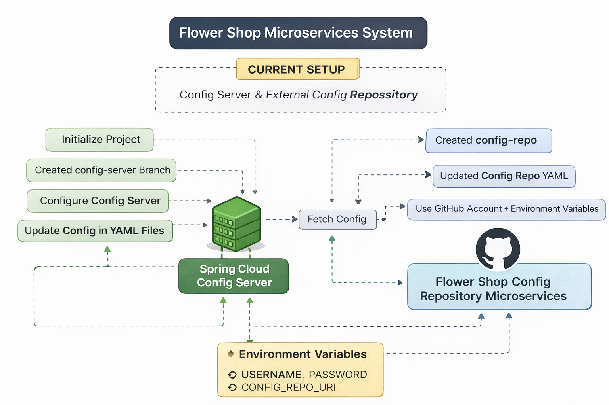

# Flower Shop Microservices System

A Spring Boot microservices learning project for building a **Flower Shop System** step by step.

This repository is currently in the **setup and infrastructure stage**.  
At this point, the project focuses on preparing the core microservices foundation, including:

- centralized configuration with **Spring Cloud Config Server**
- external configuration repository
- **HashiCorp Vault** integration for secret management
- Docker Compose setup for supporting services
- config clients that consume configuration and secrets through Config Server

---

## Current Progress

The following tasks have been completed so far:

- Initialize project structure
- Create and configure **Spring Cloud Config Server**
- Create separate **config repository**
- Connect Config Server with the external config repository
- Move repository URI, username, and password into environment variables
- Add Docker Compose for **PostgreSQL** and **Kafka**
- Add Docker Compose YAML file for **HashiCorp Vault**
- Configure **Config Server** with **HashiCorp Vault**
- Configure config clients to fetch secrets from **Vault through Config Server**
- Add two microservices:
  - `order-service`
  - `product-service`

---

## Project Goal

The goal of this project is to practice how a real microservices system is prepared from the beginning, starting with infrastructure and configuration before implementing full business logic.

This project is being built progressively to understand:

- how microservices externalize configuration
- how secrets should be managed securely
- how supporting infrastructure can be started with Docker Compose
- how multiple services can consume configuration consistently

---

## Project Setup Diagram

<p align="center">
  
</p>

---

## Architecture Overview

At the current stage, the project flow is conceptually like this:

```text
order-service / product-service
            ↓
      Spring Cloud Config Server
            ↓
   Config Repository + HashiCorp Vault
            ↓
 PostgreSQL / Kafka / other infrastructure
