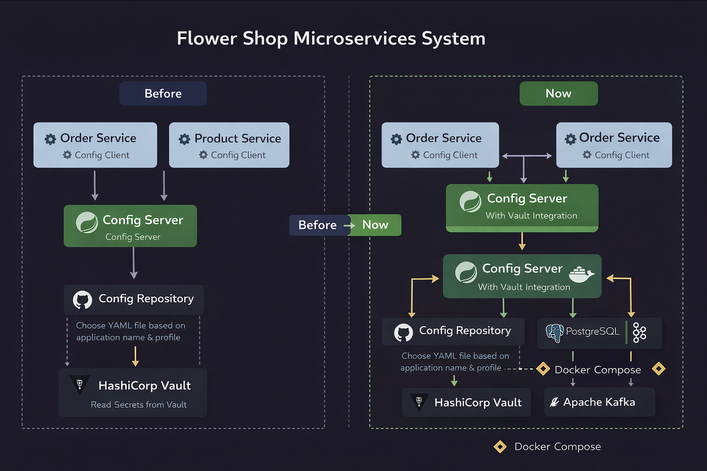
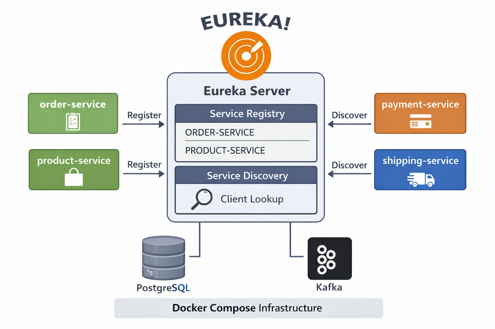

# Flower Shop Microservices System

A Spring Boot microservices learning project for building a **Flower Shop System** step by step.

This repository is currently in the **foundation and infrastructure setup stage**.  
The current focus is on building the core infrastructure of a microservices architecture before implementing full business features.

---

## Overview

This project is designed to practice how a real microservices system is structured from the beginning, including:

- centralized configuration with **Spring Cloud Config Server**
- external configuration management with a separate **config repository**
- secret management using **HashiCorp Vault**
- service discovery using **Eureka Server**
- infrastructure setup using **Docker Compose**
- relational database setup with **PostgreSQL** and **Oracle**
- change data capture preparation using **Debezium**
- configuration sharing across multiple microservices

At this stage, the project focuses mainly on infrastructure, service registration, and database integration preparation.  
Business logic will be implemented progressively in later phases.

---

## Current Progress

The following tasks have been completed so far:

- Initialize project structure
- Create and configure **Spring Cloud Config Server**
- Create separate **config repository**
- Connect Config Server to the external config repository
- Move repository URI, username, and password into environment variables
- Add Docker Compose for **PostgreSQL** and **Kafka**
- Add Docker Compose YAML file for **HashiCorp Vault**
- Configure **Config Server** with **HashiCorp Vault**
- Configure config clients to fetch secrets from **Vault through Config Server**
- Add two microservices:
  - `order-service`
  - `product-service`
- Configure **Eureka Server**
- Configure microservices to register with **Eureka**
- Add Docker Compose for **Oracle Database**
- Configure **Oracle** for **Debezium** CDC preparation

---

## Project Goal

The goal of this project is to understand how to build a microservices system in a proper sequence, starting from infrastructure and configuration first.

This project is being developed progressively to practice:

- externalized configuration management
- secure secret handling
- service discovery
- infrastructure setup with Docker Compose
- consistent configuration across services
- database integration in microservices
- preparation for future inter-service communication
- foundations of event-driven architecture with CDC

---

## Tech Stack

### Backend
- **Java**
- **Spring Boot**
- **Spring Cloud Config Server**
- **Spring Cloud Netflix Eureka**

### Secret Management
- **HashiCorp Vault**

### Infrastructure
- **Docker Compose**
- **PostgreSQL**
- **Oracle Database**
- **Apache Kafka**

### Change Data Capture
- **Debezium**

### Configuration
- **External Config Repository**
- **Environment Variables**

---

## Modules

The project currently contains the following modules:

### `config-server`
Centralized configuration server responsible for loading configuration from the external config repository and integrating with HashiCorp Vault.

### `eureka-server`
Service registry used for service discovery between microservices.

### `order-service`
Microservice client that fetches configuration from Config Server and registers itself with Eureka.

### `product-service`
Microservice client that fetches configuration from Config Server and registers itself with Eureka.

### `config-repo`
External repository used to store configuration files for all microservices.

### `deployment/postgres`
Docker Compose setup for PostgreSQL.

### `deployment/kafka`
Docker Compose setup for Kafka.

### `deployment/vault-server`
Docker Compose setup for HashiCorp Vault.

### `deployment/oracle`
Docker Compose setup for Oracle Database.

---

## Project Setup Diagram

<p align="center">
  
</p>

---

## Updated Architecture Diagram

This diagram shows the evolution of the project from the earlier configuration setup into the current stage with Docker Compose infrastructure, Vault integration, and Eureka service discovery.

<p align="center">
  
</p>

---

## Eureka Service Discovery Diagram

This diagram highlights the **Eureka Server** setup in the current stage and shows how microservices register with and discover services through Eureka.

<p align="center">
  
</p>

---

## Oracle and Debezium Stage

The project has now been extended beyond basic service registration and centralized configuration.

### Oracle Database
**Oracle Database** is added through Docker Compose as part of the infrastructure layer.  
This helps the project move closer to an enterprise-style setup and provides a database platform for learning and experimentation.

Oracle is included for:

- enterprise database practice
- persistent data storage
- future service data integration
- CDC source preparation

### Debezium
**Debezium** is introduced as part of the project’s CDC learning direction.

At this stage, the focus is on **configuring Oracle so it can be used with Debezium**, which is an important step toward event-driven microservices.  
This prepares the system to capture database changes and publish them into a streaming platform such as Kafka.

This stage helps practice:

- Oracle container setup with Docker Compose
- Oracle preparation for CDC
- understanding Debezium’s role in microservices
- database change capture concepts
- event-driven architecture foundations

---

## Architecture Overview

At the current stage, the system is organized around the following flow:

1. **Config Server** reads configuration from the external config repository.
2. **Vault** provides secret values to Config Server.
3. **Order Service** and **Product Service** fetch their configuration from Config Server during startup.
4. Both services register themselves with **Eureka Server**.
5. Supporting services such as **PostgreSQL**, **Kafka**, **Vault**, and **Oracle** are prepared with Docker Compose.
6. **Oracle** is configured as a database component for future CDC integration.
7. **Debezium** is part of the infrastructure preparation for monitoring Oracle database changes.

---

## Architecture Flow

```text
                 +----------------------+
                 |   Config Repository  |
                 +----------------------+
                            |
                            v
                 +----------------------+
                 |  Spring Config Server|
                 +----------------------+
                            ^
                            |
                 +----------------------+
                 |    HashiCorp Vault   |
                 +----------------------+

        +------------------+     +------------------+
        |   order-service  |     |  product-service |
        +------------------+     +------------------+
                 |                         |
                 +-----------+-------------+
                             |
                             v
                    +----------------+
                    | Eureka Server  |
                    +----------------+

   +-------------------+     +-------------------+     +----------------+
   |   Oracle Database | --> |     Debezium      | --> |     Kafka      |
   +-------------------+     +-------------------+     +----------------+

                    +----------------+
                    |   PostgreSQL   |
                    +----------------+
