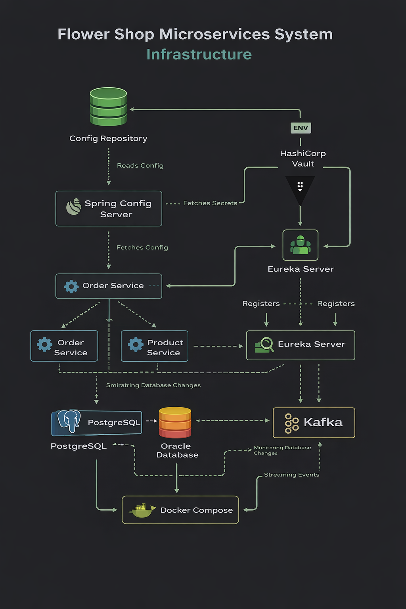
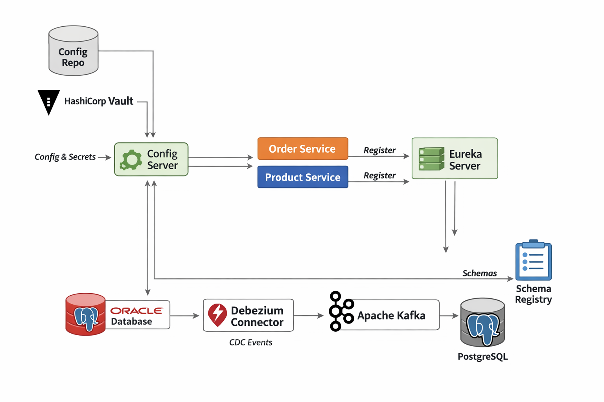
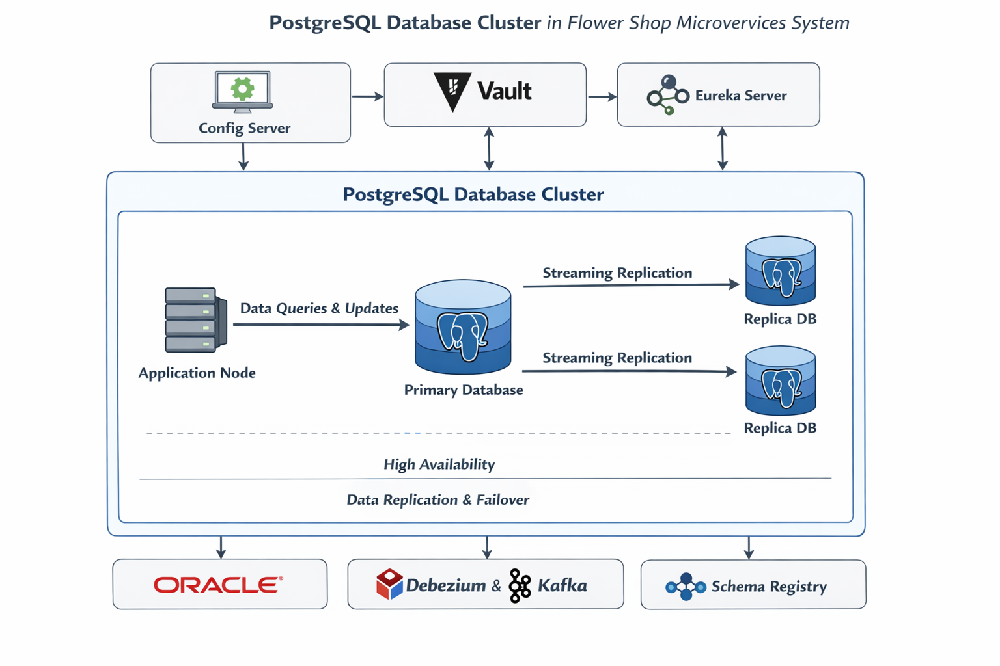
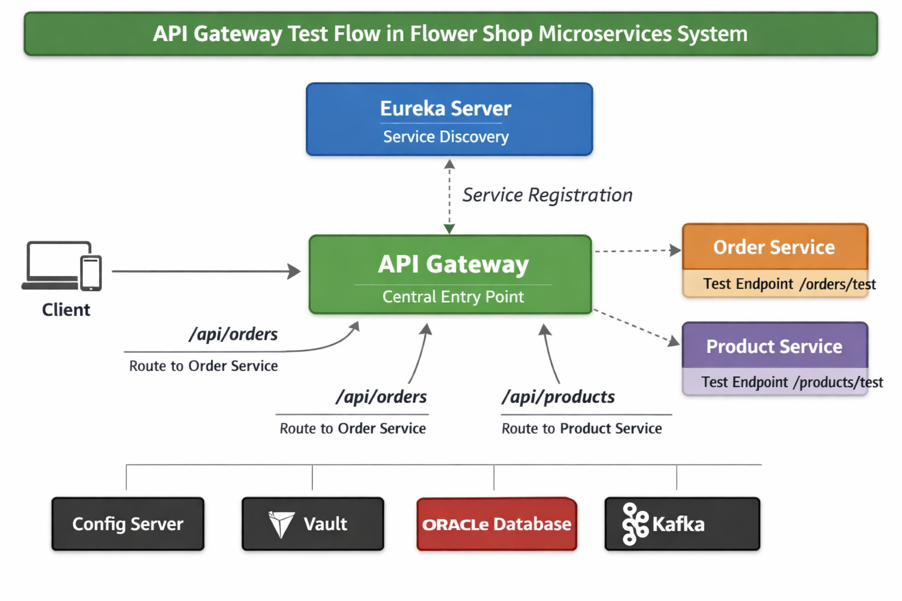

# Flower Shop Microservices System


A Spring Boot microservices learning project for building a **Flower Shop System** step by step.

This repository is currently in the **infrastructure and platform foundation stage**.  
The current focus is on establishing a strong microservices platform before implementing full flower shop business features.

---

## Table of Contents

- [Overview](#overview)
- [Current Progress](#current-progress)
- [Project Goal](#project-goal)
- [Tech Stack](#tech-stack)
- [Project Modules](#project-modules)
- [Architecture Diagrams](#architecture-diagrams)
- [Current Learning Stage](#current-learning-stage)
- [API Gateway Integration](#api-gateway-integration)
- [Architecture Overview](#architecture-overview)
- [Architecture Flow](#architecture-flow)
- [Current Focus](#current-focus)
- [Future Direction](#future-direction)
- [Summary](#summary)

---

## Overview

This project is designed to practice how a real microservices system is built in the correct sequence, starting with infrastructure and platform concerns before moving into business logic.

The system currently includes:

- centralized configuration with **Spring Cloud Config Server**
- external configuration management through a dedicated **config repository**
- secret management with **HashiCorp Vault**
- service discovery with **Eureka Server**
- centralized access and request routing with **API Gateway**
- infrastructure provisioning with **Docker Compose**
- relational database setup with **PostgreSQL** and **Oracle Database**
- event streaming infrastructure with **Apache Kafka**
- change data capture with **Debezium**
- schema management with **Schema Registry**

At this stage, the project focuses on platform readiness, configuration flow, service registration, gateway-based access, database preparation, and CDC integration.

---

## Current Progress

The following tasks have been completed so far:

- Initialized the project structure
- Created and configured **Spring Cloud Config Server**
- Created a separate **config repository**
- Connected Config Server to the external config repository
- Moved repository URI, username, and password into environment variables
- Added Docker Compose setup for **PostgreSQL**
- Added Docker Compose setup for **Kafka**
- Added Docker Compose setup for **HashiCorp Vault**
- Configured **Config Server** with **Vault**
- Configured config clients to load secrets from **Vault through Config Server**
- Added two microservices:
  - `order-service`
  - `product-service`
- Configured **Eureka Server**
- Configured microservices to register with **Eureka**
- Added **API Gateway**
- Configured gateway routes for microservices
- Added test endpoints for route verification
- Verified that services can be accessed through **API Gateway**
- Verified centralized routing from gateway to backend services
- Added Docker Compose setup for **Oracle Database**
- Prepared **Oracle** for **Debezium** CDC
- Configured **Debezium**
- Configured **Schema Registry**
- Integrated **Debezium with Schema Registry**

---

## Project Goal

The goal of this project is to understand how to build a microservices system in a proper sequence, beginning with infrastructure and platform concerns first, then extending into business capabilities.

This project is being developed progressively to practice:

- externalized configuration management
- secure secret handling
- service discovery
- centralized gateway-based access and routing
- infrastructure setup with Docker Compose
- consistent configuration across microservices
- relational database integration
- CDC-based event streaming
- schema-aware event architecture
- foundations for future inter-service communication

---

## Tech Stack

### Backend
- **Java**
- **Spring Boot**
- **Spring Cloud Config Server**
- **Spring Cloud Netflix Eureka**
- **Spring Cloud Gateway**

### Secret Management
- **HashiCorp Vault**

### Infrastructure
- **Docker Compose**
- **PostgreSQL**
- **Oracle Database**
- **Apache Kafka**

### Change Data Capture and Event Schema
- **Debezium**
- **Schema Registry**

### Configuration
- **External Config Repository**
- **Environment Variables**

---

## Project Modules

### `config-server`
Centralized configuration server responsible for loading configuration from the external config repository and integrating with HashiCorp Vault.

### `eureka-server`
Service registry used for service discovery across microservices.

### `api-gateway`
Gateway service that acts as the centralized entry point for incoming requests.

It is responsible for:

- routing requests to backend microservices
- simplifying service access through a single entry point
- verifying service connectivity through gateway routes
- preparing the platform for future concerns such as authentication, filtering, rate limiting, and request control

### `order-service`
Microservice client that loads configuration from Config Server and registers itself with Eureka.

### `product-service`
Microservice client that loads configuration from Config Server and registers itself with Eureka.

### `config-repo`
External repository that stores configuration files for all microservices.

### `deployment/postgres`
Docker Compose setup for PostgreSQL.

### `deployment/kafka`
Docker Compose setup for Kafka and related messaging infrastructure.

### `deployment/vault-server`
Docker Compose setup for HashiCorp Vault.

### `deployment/oracle`
Docker Compose setup for Oracle Database.

---

## Architecture Diagrams

### Project Setup Diagram

<p align="center">
  
</p>

### Updated Architecture Diagram

This diagram shows how the project has evolved from the initial configuration stage into a broader infrastructure platform with Docker Compose, Vault, Eureka, API Gateway, Oracle, Debezium, and Schema Registry.

<p align="center">
  
</p>

### Eureka Service Discovery Diagram

This diagram highlights the **Eureka Server** setup and shows how services register themselves for discovery within the platform.

<p align="center">
  
</p>

### Oracle, Debezium, and Schema Registry Infrastructure Diagram

This diagram shows the infrastructure expansion of the project with **Oracle Database**, **Debezium**, and **Schema Registry** added to the platform.

It highlights how the system is evolving beyond configuration and service discovery into a more event-driven architecture that supports:

- enterprise database usage with **Oracle**
- database change capture with **Debezium**
- event streaming through **Kafka**
- schema consistency through **Schema Registry**

<p align="center">
  
</p>

### Debezium and Schema Registry Integration Diagram

This diagram shows the infrastructure update where **Debezium** is configured together with **Schema Registry** in the Flower Shop Microservices System.

It highlights the current platform flow:

- **Oracle Database** acts as the CDC source
- **Debezium Connector** captures database changes
- **Apache Kafka** transports CDC events
- **Schema Registry** manages event schemas
- **Config Server**, **Vault**, and **Eureka Server** remain part of the core platform foundation

<p align="center">
  
</p>

### PostgreSQL Database Setup Diagram

This diagram shows the infrastructure update where a **PostgreSQL database cluster** is configured as part of the Flower Shop Microservices System.

It highlights the current platform improvement:

- **PostgreSQL cluster** is prepared for a stronger database foundation
- database services are organized for better scalability and availability
- the project continues evolving from basic service setup into a more production-oriented platform
- **Config Server**, **Vault**, **Eureka Server**, **Oracle**, **Debezium**, and **Schema Registry** remain part of the overall system foundation

<p align="center">
  
</p>

### API Gateway Test Flow Diagram

This diagram shows the infrastructure update where **API Gateway** is configured as the centralized entry point for backend services.

It highlights the current platform improvement:

- **API Gateway** acts as the main access layer for microservices
- requests can be routed to backend services through a single entry point
- service lookup is supported by **Eureka Server**
- test endpoints are used to verify that routing is working correctly
- the platform is moving toward a more realistic microservices communication model

<p align="center">
  
</p>

---

## Current Learning Stage

The project has now moved beyond basic configuration and service registration.

### Oracle Database
**Oracle Database** is added through Docker Compose as part of the infrastructure layer.

It is included for:

- enterprise database practice
- persistent data storage
- future service data integration
- CDC source preparation

### Debezium
**Debezium** is introduced to support change data capture.

At this stage, the focus is on configuring Oracle and Debezium so the system can capture database changes and publish them as events.

This helps practice:

- Oracle container setup with Docker Compose
- Oracle preparation for CDC
- Debezium connector configuration
- database change capture concepts
- event-driven architecture foundations

### Schema Registry
**Schema Registry** is added to manage and standardize event schemas in the streaming layer.

This is important for building reliable event-driven systems because it helps producers and consumers share a consistent contract for message structure.

This stage helps practice:

- schema-aware event design
- event structure consistency across services
- Debezium integration with schema-based messaging
- stronger foundations for future Kafka consumers and producers

---

## API Gateway Integration

The project has advanced into the next important platform layer by adding **API Gateway**.

### API Gateway
**API Gateway** is introduced as the centralized access point for backend services.

It is included for:

- a unified entry point for microservices
- easier service testing from one location
- route management between clients and services
- preparation for future security and gateway-level controls

At this stage, the focus is on configuring routes and adding simple test endpoints so that each service can be reached through the gateway.

This helps practice:

- gateway routing configuration
- service access through a centralized layer
- testing microservice endpoints without calling services directly
- understanding how client requests flow through the gateway before reaching backend services

---

## Architecture Overview

At the current stage, the system follows this general flow:

1. **Config Server** reads configuration from the external config repository.
2. **Vault** provides secret values to Config Server.
3. **Order Service**, **Product Service**, and other microservices fetch their configuration from Config Server during startup.
4. Microservices register themselves with **Eureka Server** for service discovery.
5. **API Gateway** acts as the centralized entry point for external access.
6. The gateway uses service discovery information to resolve and route requests to the correct microservice.
7. Test endpoints are used to verify that routing through the gateway works correctly.
8. Supporting services such as **PostgreSQL**, **Kafka**, **Vault**, and **Oracle** are provisioned with Docker Compose.
9. **Oracle** is prepared as the CDC source database.
10. **Debezium** captures database changes from Oracle.
11. **Kafka** transports change events.
12. **Schema Registry** manages event schemas for more consistent event processing.

---

## Architecture Flow

```text
                 +----------------------+
                 |   Config Repository  |
                 +----------------------+
                            |
                            v
                 +----------------------+
                 |  Spring Config Server|
                 +----------------------+
                            ^
                            |
                 +----------------------+
                 |    HashiCorp Vault   |
                 +----------------------+

+-----------+         +----------------+         +------------------+
|  Client   | ------> |  API Gateway   | ------> |   order-service  |
+-----------+         +----------------+         +------------------+
                               |
                               |------> +------------------+
                                        |  product-service |
                                        +------------------+

                 +--------------------------------------+
                 |            Eureka Server             |
                 +--------------------------------------+
                    ^               ^               ^
                    |               |               |
                    | register      | register      | discover
                    |               |               |
          +----------------+  +------------------+  +------------------+
          |  API Gateway   |  |   order-service  |  |  product-service |
          +----------------+  +------------------+  +------------------+


   +-------------------+     +-------------------+     +----------------+
   |   Oracle Database | --> |     Debezium      | --> |     Kafka      |
   +-------------------+     +-------------------+     +----------------+
                                                           |
                                                           v
                                                +----------------------+
                                                |   Schema Registry    |
                                                +----------------------+

                    +----------------+
                    |   PostgreSQL   |
                    +----------------+
